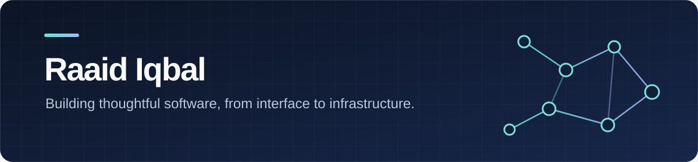

  

   

  <a href="https://github.com/raaidiqbal?tab=repositories"><strong>Explore my projects</strong></a>
  &nbsp;·&nbsp;
  <a href="https://github.com/raaidiqbal/Seonsu"><strong>See what I'm building</strong></a>

## About me

I'm Raaid, a developer interested in the whole path from a useful idea to a working product. I enjoy building clear interfaces, dependable backend systems, and understanding the networks that connect them.

Right now, I'm building **[Seonsu](https://github.com/raaidiqbal/Seonsu)**, a return-to-sport recovery prototype with a React and TypeScript interface, versioned progression rules, and a Cloudflare D1 backend.

## Selected work

| Project | What it does | Built with |
| :--- | :--- | :--- |
| **[Seonsu](https://github.com/raaidiqbal/Seonsu)** | Tracks a focused recovery pathway with check-ins, exercise completion, and rule-based progression. | TypeScript, React, Cloudflare Workers, D1 |
| **[ZApp](https://github.com/raaidiqbal/Zapp)** | A campus marketplace concept connecting buyers, sellers, and workers. | JavaScript, full-stack web |
| **[NextEpisode](https://github.com/raaidiqbal/NextEpisode)** | A team-built anime discovery site with search, genre filters, rankings, and a random pick feature. | Python, Flask, HTML, CSS |
| **[Network Topology](https://github.com/raaidiqbal/Raaid-Network-Topology)** | Network projects and analyses spanning Gopher, routing, TCP, and DNS. | Python, networking tools |

## What I work with

`TypeScript` &nbsp; `JavaScript` &nbsp; `React` &nbsp; `Python` &nbsp; `Flask` &nbsp; `SQL` &nbsp; `Cloudflare Workers`

  Thanks for visiting — explore the repositories above to see the work behind each project.

